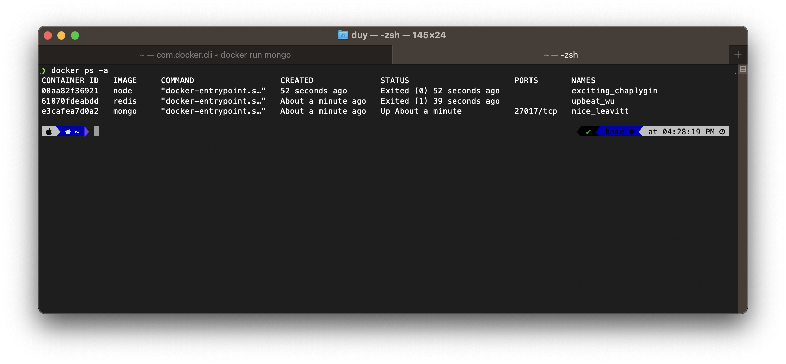

---

```console
❯ docker ps -a
CONTAINER ID   IMAGE     COMMAND                  CREATED              STATUS                      PORTS       NAMES
00aa82f36921   node      "docker-entrypoint.s…"   52 seconds ago       Exited (0) 52 seconds ago               exciting_chaplygin
61070fdeabdd   redis     "docker-entrypoint.s…"   About a minute ago   Exited (1) 39 seconds ago               upbeat_wu
e3cafea7d0a2   mongo     "docker-entrypoint.s…"   About a minute ago   Up About a minute           27017/tcp   nice_leavitt
```